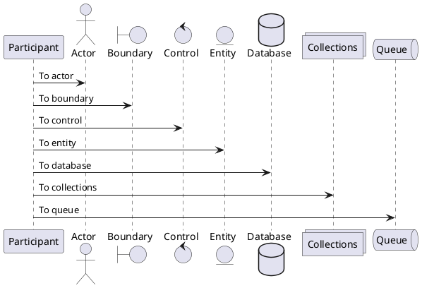
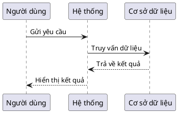
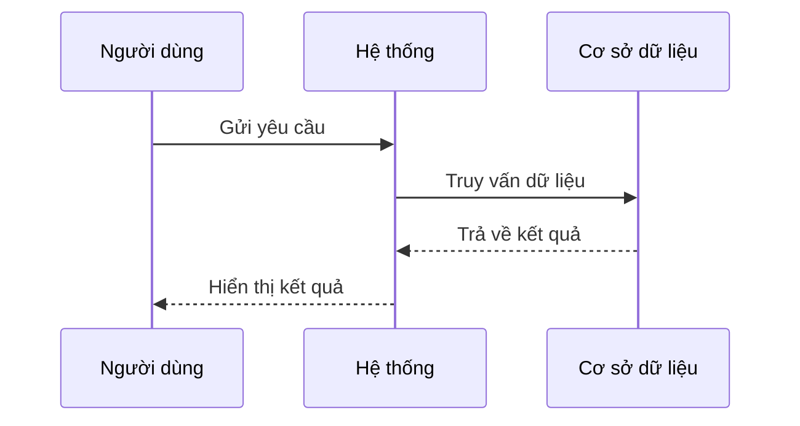
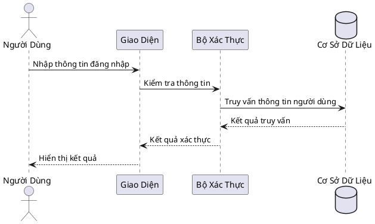
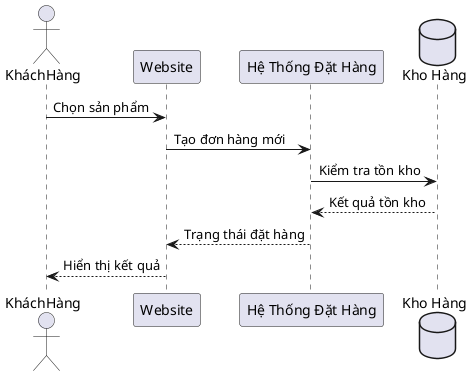
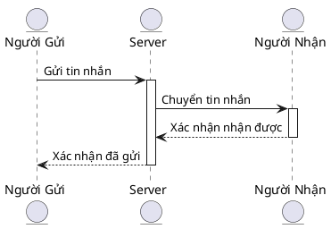

# tpphu.github.io

# Sequence Diagram

## Các loại participant

Có các loại participant:

- participant (default)
- actor
- boundary
- control
- entity
- database
- collections
- queue

#

# Examples

## Basic Example

### Với PlantUML

## Với MermaidJS

### Đăng nhập

### Quy trình đặt hàng

### Gửi và Nhận Tin Nhắn

